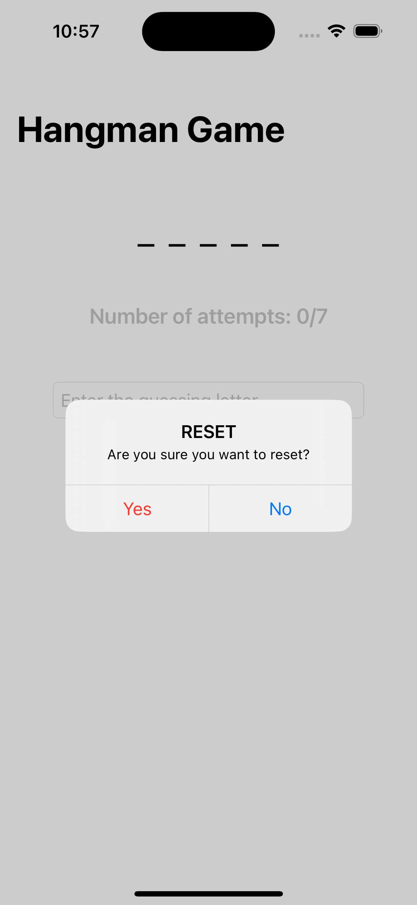
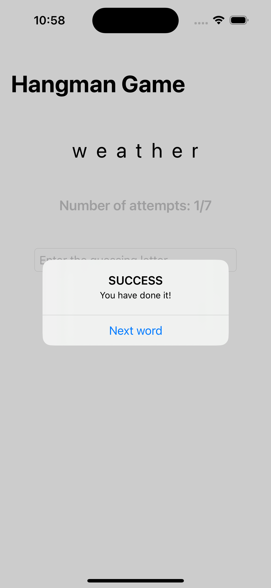

# Hangman Game
### Simple Game application using UIKit programmatically

- The goal of this game is for the user to guess the word that was chosen randomly in as few steps as possible. Words are read randomly from a `words.txt` file that is part of the project.

> Learned how to read and manipulate content of specific file inside project.

> Learned how to use weak capturing 

> Learned how to use GCD for choosing which process will be executed on background thread

> Learned how to use and manipulate UITextView (restriction for only one letter)
### App preview

 

